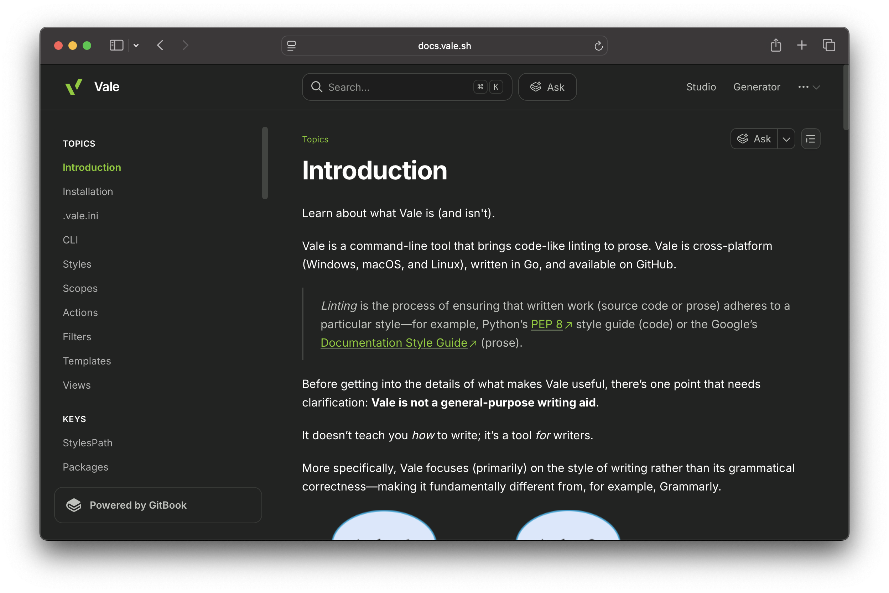

<div align="center">
  <h1>vale.sh</h1>
  <p><strong>The website for <a href="https://github.com/vale-cli/vale">Vale</a> — the command-line tool that brings code-like linting to prose.</strong></p>
  <p>
    <a href="https://vale.sh"></a>
    <a href="https://docs.vale.sh"></a>
    <a href="https://app.netlify.com/sites/eclectic-semifreddo-be083c/deploys"></a>
    <a href="https://github.com/vale-cli/vale"></a>
  </p>
  <a href="https://docs.vale.sh"></a>
</div>

---

## Contents

| Path                            | What lives there                                                       |
| ------------------------------- | ---------------------------------------------------------------------- |
| [`src/`](src)                   | The SvelteKit site — landing page, explorer, library, generator        |
| [`docs/`](docs)                 | The documentation, synced with [docs.vale.sh](https://docs.vale.sh)    |
| [`src/lib/data/`](src/lib/data) | Adopters, press, and events — the three files most contributions touch |
| [`script/`](script)             | Data validation and avatar syncing                                     |

## Quick start

```bash
pnpm install
pnpm run dev -- --open
```

| Command             | What it does                                           |
| ------------------- | ------------------------------------------------------ |
| `pnpm run dev`      | Development server                                     |
| `pnpm run build`    | Production build                                       |
| `pnpm run validate` | Check `adopters.json`, `press.json`, and `events.json` |
| `pnpm run check`    | Type-check with `svelte-check`                         |
| `pnpm run lint`     | Prettier and ESLint                                    |

Home page numbers — downloads, stars, backers — are read from the GitHub, Docker
Hub, PyPI, conda-forge, Homebrew, Chocolatey, and Open Collective APIs at **build
time** (see [`src/lib/server/stats.ts`](src/lib/server/stats.ts)). Each lookup
falls back to a checked-in value, so a failed request never breaks the build. Set
`GITHUB_TOKEN` in the build environment to keep the GitHub calls off the 60/hr
per-IP limit.

## Documentation

The docs live at **[docs.vale.sh](https://docs.vale.sh)**, published from GitBook
and synced to [`docs/`](docs) in this repository. The two stay in step
automatically: a commit to `docs/` updates the site, and an edit made in GitBook
lands here as a commit.

So you can contribute either way. Editing the Markdown under `docs/` and opening
a pull request is the usual route — your PR gets a preview URL as a status check,
so you can see the rendered page before it merges.

> [!IMPORTANT]
> Two files are not yours to edit. `docs/SUMMARY.md` is the table of contents and
> is generated by GitBook, so change the page tree in GitBook instead.
> `.gitbook.yaml` tells the sync that content lives in `docs/`.

The site used to render these pages itself from `src/lib/content`. It no longer
does — `vale.sh/docs/*` redirects to `docs.vale.sh` (see
[`static/_redirects`](static/_redirects)).

## Contributing

### Add your team to the home page

If your team runs Vale, add an entry to
[`src/lib/data/adopters.json`](src/lib/data/adopters.json). Every entry needs a
**public link** that shows Vale in use — a `.vale.ini`, a style package, or a
write-up. Entries without one get removed.

```json
{
	"name": "Elastic",
	"category": "Data & observability",
	"context": "Ships an Elastic style guide implemented as Vale rules.",
	"url": "https://www.elastic.co/docs/contribute-docs/vale-linter",
	"icon": "elastic"
}
```

| Field      | Required | Notes                                                                     |
| ---------- | -------- | ------------------------------------------------------------------------- |
| `name`     | yes      | How your team is normally written.                                        |
| `category` | yes      | One of the six categories below.                                          |
| `context`  | yes      | One sentence, ending in a period, on what Vale does for you.              |
| `url`      | yes      | `https://` link to the public proof.                                      |
| `icon`     | no       | A [Simple Icons](https://simpleicons.org) slug, e.g. `elastic`, `gitlab`. |
| `github`   | no       | GitHub org login, e.g. `aiven`. Used when there's no icon.                |

Categories: `Cloud & infrastructure`, `Community & services`,
`Data & observability`, `Developer tools`, `Enterprise`, `Open source`.

Set **either** `icon` or `github`, not both. Simple Icons doesn't carry every
brand — Microsoft and AWS, for example — so `github` falls back to your org's
avatar. With neither, the card shows a two-letter monogram.

> [!NOTE]
>
> **Don't commit images.** The avatar PNGs under `static/users/avatars` are
> fetched from the `github` field by a maintainer running
> `node script/adopters.mjs --sync`.

### Add a post, talk, or video

Add an entry to [`src/lib/data/press.json`](src/lib/data/press.json):

```json
{
	"type": "article",
	"title": "Prose linting with Vale",
	"outlet": "Meilisearch",
	"author": "Maryam Sulemani",
	"year": 2023,
	"url": "https://blog.meilisearch.com/prose-linting-with-vale/"
}
```

| Field      | Required | Notes                                                         |
| ---------- | -------- | ------------------------------------------------------------- |
| `type`     | yes      | `book`, `paper`, `talk`, `article`, `video`, or `newsletter`. |
| `title`    | yes      | The title as published.                                       |
| `outlet`   | yes      | Publication, company, or conference.                          |
| `url`      | yes      | `https://` link.                                              |
| `author`   | no       | Byline, if there is one.                                      |
| `year`     | no       | Integer.                                                      |
| `subtitle` | no       | Books only.                                                   |

A link can appear **once** on the page. If your company blog post is already an
adopter's `url`, don't add it here too — the validator rejects it.

### Add an upcoming event

Add an entry to [`src/lib/data/events.json`](src/lib/data/events.json):

```json
{
	"title": "Social Coworking and Office Hours: Vale and Text Linting",
	"host": "rOpenSci",
	"date": "2026-08-04",
	"time": "01:00–03:00 UTC",
	"location": "Online",
	"url": "https://ropensci.org/events/coworking-2026-08/"
}
```

| Field      | Required | Notes                                           |
| ---------- | -------- | ----------------------------------------------- |
| `title`    | yes      | The event or session title.                     |
| `host`     | yes      | Organizer, e.g. `rOpenSci`.                     |
| `date`     | yes      | Start date, `YYYY-MM-DD`.                       |
| `location` | yes      | `Online`, or a city.                            |
| `url`      | yes      | `https://` link to register or read more.       |
| `endDate`  | no       | `YYYY-MM-DD`, for events spanning several days. |
| `time`     | no       | Free text, e.g. `01:00–03:00 UTC`.              |

**Finished events don't need removing.** The section filters by date at both
build and page load, so an event disappears — along with its nav link, and the
whole section once nothing is left — as soon as it's over. The validator prints a
note for entries that have already passed, so they can be cleared out later.

### Check your change

```bash
pnpm run validate
```

This validates all three files: required fields, known categories and types,
`https://` URLs, unique names and links, real Simple Icons slugs, and well-formed
dates. CI runs the same command on every push.

### Share a package or configuration

If you have a Vale package or configuration you'd like to share, open a pull
request against the [`packages`](https://github.com/vale-cli/packages)
repository.
