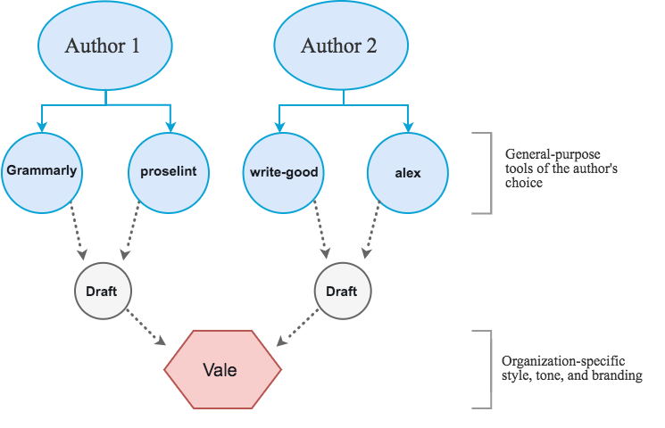
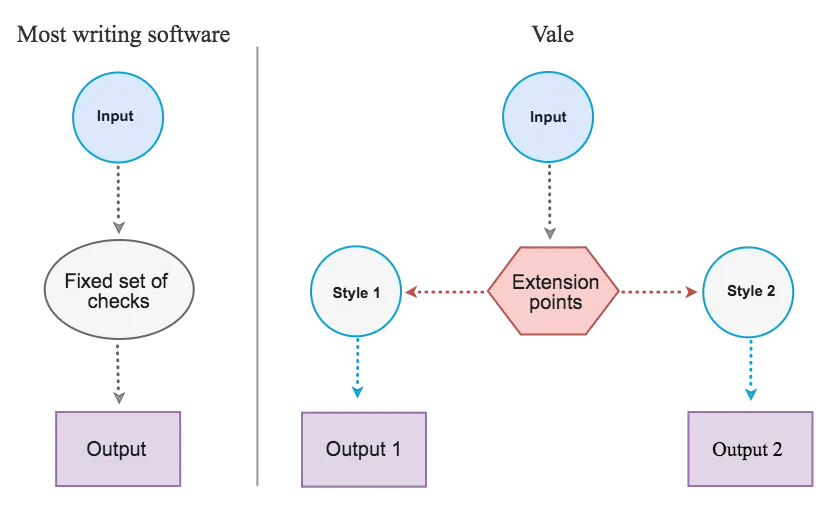
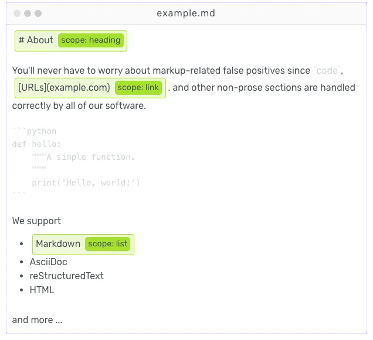

# Introduction

Learn about what Vale is (and isn't).

Vale is a command-line tool that brings code-like linting to prose. Vale is cross-platform (Windows, macOS, and Linux), written in Go, and available on GitHub.

> _Linting_ is the process of ensuring that written work (source code or prose) adheres to a particular style—for example, Python’s [PEP 8](https://www.python.org/dev/peps/pep-0008/) style guide (code) or the Google’s [Documentation Style Guide](https://developers.google.com/style/) (prose).

Before getting into the details of what makes Vale useful, there’s one point that needs clarification: **Vale is not a general-purpose writing aid**.

It doesn’t teach you _how_ to write; it’s a tool _for_ writers.

More specifically, Vale focuses (primarily) on the style of writing rather than its grammatical correctness—making it fundamentally different from, for example, Grammarly.



In other words, Vale focuses on ensuring consistency across multiple authors (according to customizable guidelines) rather than the general “correctness” of a single author’s work.

This distinction is particularly important to understand because Vale doesn’t offer any of its own advice. Instead, it offers a framework for creating and enforcing [custom rules](topics/styles.md). Its approach is much more similar to code linters than it is to traditional grammar checkers.

## [Your style, our editor](./#your-style-our-editor)

One of Vale’s most important features is its ability to support external styles through its extension system, which only requires some familiarity with the YAML file format (and, optionally, regular expressions).



To get a better idea of how this works, let’s look at an example from the [Linode documentation](https://github.com/linode/docs/blob/master/ci/vale/styles/Linode/Terms.yml):


```yaml
# `extends` specifies the extension point you're using. Here, we're
# using `substitution` to ensure correct usage of some technical and
# brand-specifc terminology.
extends: substitution
# `message` allows you to customize the output shown to your users.
message: Use '%s' instead of '%s'.
# We're setting this rule's severity to `error`, which will cause
# CI builds to fail.
level: error
# We're using case-insensitive patterns.
ignorecase: true
swap:
  "(?:LetsEncrypt|Let's Encrypt)": Let's Encrypt
  'node[.]?js': Node.js
  'Post?gr?e(?:SQL)': PostgreSQL
  'java[ -]?scripts?': JavaScript
  linode cli: Linode CLI
  linode manager: Linode Manager
  linode: Linode
  longview: Longview
  nodebalancer: NodeBalancer
```


In the above example, we’ve defined a few terms that have a particular capitalization style. If Vale finds an instance of a term that matches a pattern on the left of swap (case-insensitive) but doesn’t exactly match the value on the right, it issues an error. So, for example, `Nodebalancer`, `nodebalancer` or any other variation that doesn’t exactly match `NodeBalancer` will be flagged as an error.

While this example may appear quite simple, it’s possible to achieve fairly high coverage on complete editorial style guides. Check out the [Explorer](https://vale.sh/explorer) for more examples.

## [Syntax- and context-aware linting](./#syntax--and-context-aware-linting)

Another feature that separates Vale from other linters is its ability to understand its input at both a syntactic and contextual level.



This level of understanding gives you fine-grained control over the linting process, including the ability to limit rules to certain sections (e.g., only headings) or ignore sections entirely (block and inline code are ignored by default).

Additionally, since Vale is built on top of an NLP library, you can also target specific segments of text—allowing you to, for example, warn about paragraphs that exceed a certain number of words or sentences that end with prepositions.

## [Tech stack](./#tech-stack)

Vale is a 100% open-source, MIT-licensed project that consists of multiple parts:

| Name                                                      | Tech       | Info                                                                                                         |
| --------------------------------------------------------- | ---------- | ------------------------------------------------------------------------------------------------------------ |
| [`vale`](https://github.com/errata-ai/vale)               | Go         | The main repository containing the Vale command-line interface.                                              |
| [`vale-ls`](https://github.com/errata-ai/vale-ls)         | Rust       | An implementation of the Language Server Protocol (LSP) for the Vale command-line tool.                      |
| [`vale.sh`](https://github.com/errata-ai/vale.sh)         | Svelte     | Website and documentation for the Vale CLI and related projects.                                             |
| [`vale-action`](https://github.com/errata-ai/vale-action) | TypeScript | The official GitHub Action for Vale -- install, manage, and run Vale with ease.                              |
| [`packages`](https://github.com/errata-ai/packages)       | YAML       | A collection of pre-packaged, Vale-compatible style guides and configurations.                               |
| [`vale-native`](https://github.com/errata-ai/vale-native) | Go         | A native messaging host for the Vale CLI: Use your local configurations in Chrome, Firefox, Opera, and Edge. |

[Quickstart](topics/quickstart.md)
