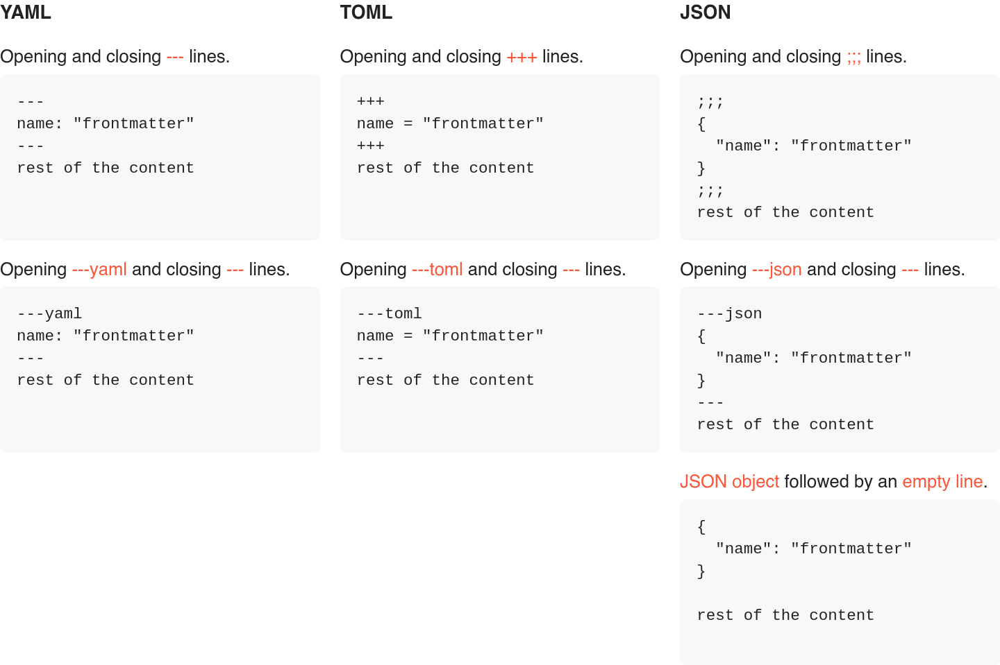

# Front Matter

Learn how Vale handles front matter.

Linting front matter fields is supported in Markdown, AsciiDoc, reStructuredText, MDX, and Org files.

There are 3 supported front matter types – YAML, TOML, and JSON:



Each field is dynamically assigned its own scope, allowing you to write rules that target specific ones:

```yaml
---
title: 'My document'
description: "A short summary of the document's purpose."
author: 'John Doe'
---
```

Using the example above, the generated scopes would be `text.frontmatter.title`, `text.frontmatter.description`, and `text.frontmatter.author`.

A rule can then use these in its `scope:` field:

```yaml
extends: capitalization
message: "'%s' should be in title case"
level: warning
scope: text.frontmatter.title
```

This rule would then only be applied to the `title` field in the front matter.
