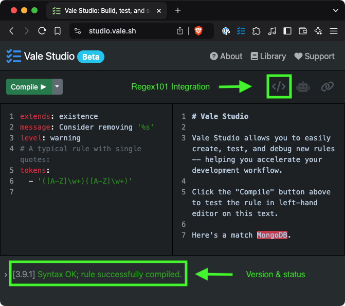

# Regex

Learn how to use regex in Vale.

Vale uses the [`regexp2`](https://github.com/dlclark/regexp2) library to process regular expressions in its rules. This library extends the capabilities of the standard Go [regexp](https://pkg.go.dev/regexp/syntax) package by supporting features like lookaheads, lookbehinds, and lazy quantifiers, which are missing in Go’s built-in regexp implementation.

This guide provides an overview of regex syntax supported by Vale, along with tips for writing regular expressions in [YAML](https://yaml.org/) files.

## [Syntax](regex.md#syntax)

For basic information on the supported syntax, see the [Go docs](https://pkg.go.dev/regexp/syntax). For the extended syntax provided by `regexp2`, see their [README](https://github.com/dlclark/regexp2?tab=readme-ov-file#compare-regexp-and-regexp2).

The most commonly used assertion constructs are:

* Positive lookahead: `(?=re)`
* Negative lookahead: `(?!re)`
* Positive lookbehind: `(?<=re)`
* Negative lookbehind: `(?<!re)`

This extended syntax is supported everywhere in Vale, except for `script`-based rules (which are limited to the standard Go regex syntax).

## [YAML](regex.md#yaml)

Wrap all regex in single (`'`) or double (`"`) quotes to avoid YAML interpreting special characters:

* Single quotes (`'`): Prevent YAML from interpreting any characters except single quotes themselves.
* Double quotes (`"`): Allow YAML to interpret escape sequences like `\n` and `\t`, so you’ll need to escape backslashes.

In general, this means that you should **prefer single quotes** for most cases:

```yaml
extends: existence
message: Consider removing '%s'
level: warning
# A typical rule with single quotes:
tokens:
  - '([A-Z]\w+)([A-Z]\w+)'
```

If you need to _use_ a single quote in your regex, you can escape it with another single quote:

```yaml
extends: existence
message: Consider removing '%s'
level: warning
# A rule with a single quote in the regex:
tokens:
  - '([A-Z]\w+)([A-Z]\w+)''s'
```

## [Vale Studio](regex.md#vale-studio)

[Vale Studio](https://studio.vale.sh/) provides a rule editor that integrates with [regex101](https://regex101.com/) to allow you to inspect the compiled regex pattern and test it against sample text. This can be a helpful way to debug your regex patterns.



## [Common Issues](regex.md#common-issues)

<details>

<summary>Word Boundaries</summary>

In regex, `\b` is a word boundary assertion that matches the position between a word character and a non-word character.

For example, the regex `\bfoo\b` will only match the word “foo” and not “foobar” or “foo-bar”.

By default, [`existence`](../checks/existence.md) and [`substitution`](../checks/substitution.md) rules in Vale will automatically add word boundaries to the beginning and end of each token.

To disable this behavior, set `nonword` to `true`:

```yaml
extends: existence
message: Consider removing '%s'
nonword: true
tokens:
  - some token
```

</details>

<details>

<summary>Scoping</summary>

For markup-based rules, Vale converts each document to HTML and applies a [scoping](../topics/scopes.md) system before running any rules.

This means that if you’re writing a rule that targets markup syntax or needs to match across block boundaries, the results may be different from what you expect.

If you like to apply a rule to the entire, unprocessed document, you can use `scope: raw`:

```yaml
extends: existence
message: Consider removing '%s'
scope: raw
tokens:
  - some token
```

</details>
