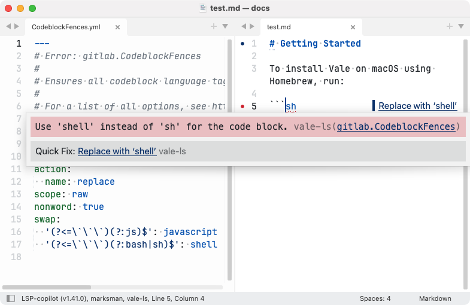
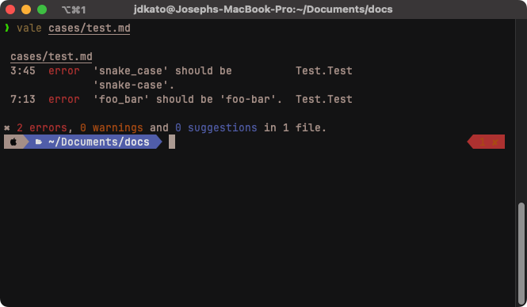

# Actions

Create dynamic suggestions for your rules with Actions.


Heads up!

See [`vale-ls`](../guides/lsp.md) for an easy way to integrate Actions into your favorite text editor.


Actions provide a way for users to define dynamic fixes for their custom rules that show up in the CLI and LSP-based integrations.



In the Sublime Text example above, the “Quick Fix” menu is powered by the action defined in the rule definition:


```yaml
action:
  name: replace
```


See the documentation on each `action` type for more information:

| Name                             | Description                                                                                  |
| -------------------------------- | -------------------------------------------------------------------------------------------- |
| [`suggest`](../fixes/suggest.md) | An array of dynamically-computed suggestions.                                                |
| [`replace`](../fixes/replace.md) | An array of static suggestions. Supported by default in `substitution` and `capitalization`. |
| [`remove`](../fixes/remove.md)   | Remove the matched text.                                                                     |
| [`edit`](../fixes/edit.md)       | In-place edits of the matched text.                                                          |

## [CLI](actions.md#cli)

Most Vale rules are based on _static_ suggestions—for example,


```yaml
extends: substitution
message: "Use '%s' instead of '%s'."
level: error
action:
  name: replace
swap:
  Javascript: JavaScript
```


Here, the `action` is a to _replace_`Javascript` with `JavaScript`. In such cases, we know what we want to suggest to the user ahead of time and Vale can easily generate the appropriate output message.

However, there are cases in which we _don’t_ know the appropriate suggestion ahead of time. For example, consider the following rule:


```yaml
extends: existence
message: "'%s' should be '%s'."
level: error
action:
  name: edit
  params:
    - regex
    - '(\w+)_(\w+)'
    - '$1-$2'
tokens:
  - '\w+_\w+'
```


This rule is designed to catch instances of `snake_case` and suggest that the user convert to `kebab-case`. In this case, the exact suggestion is dependent on a string transformation that needs to be computed at runtime.

Using the `edit` action allows us to define a rule that can dynamically generate suggestions based on the matched text in CLI output:



As you can see, the CLI output is dynamically computing the suggestion based on the matched text.

## [LSP](actions.md#lsp)

In both static and dynamic cases, any application that uses the [Vale Language Server](../guides/lsp.md) will be able to provide the user with a list of “Quick Fixes” that can be applied to the document.

[Scopes](scopes.md) [Filters](filters.md)
