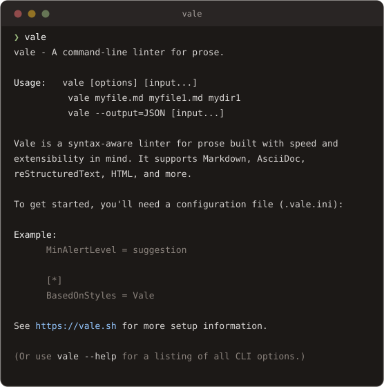
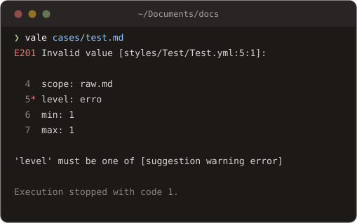

# CLI

Learn about the Vale command-line interface.

The Vale CLI is a powerful tool for linting your content in a variety of formats. To get started, try running with no arguments:



## [Environment variables](cli.md#environment-variables)

The following list of environment variables are supported by the `vale` command-line interface:

| Variable           | Description                                                         |
| ------------------ | ------------------------------------------------------------------- |
| `VALE_CONFIG_PATH` | Override the default search process by specifying a .vale.ini file. |
| `VALE_STYLES_PATH` | Specify the location of the default StylesPath.                     |

You can inspect the current environment variables by running:

```
$ vale ls-vars
```

The exact steps for setting environment variables depend on your operating system, but here are some useful links for [Windows](https://learn.microsoft.com/en-us/windows-server/administration/windows-commands/setx) and [macOS](https://support.apple.com/guide/terminal/use-environment-variables-apd382cc5fa-4f58-4449-b20a-41c53c006f8f/mac).

## [CLI options](cli.md#cli-options)

| Name              | Description                                                                                                                                                             |
| ----------------- | ----------------------------------------------------------------------------------------------------------------------------------------------------------------------- |
| `sync`            | <p>Download and install packages. See <a href="../keys/packages.md">Packages</a> for more information.<br><code>$ vale sync</code></p>                                  |
| `ls-config`       | <p>Print the current configuration options as JSON.<br><code>$ vale ls-config</code></p>                                                                                |
| `ls-metrics`      | <p>Print the computed metrics for the given file. See <a href="../checks/metric.md">metric</a> for more information.<br><code>$ vale ls-metrics path/to/file</code></p> |
| `ls-dirs`         | <p>Print the location of default configuration directories.<br><code>$ vale ls-dirs</code></p>                                                                          |
| `ls-vars`         | <p>Print the supported environment variables.<br><code>$ vale ls-vars</code></p>                                                                                        |
| `--config`        | <p>Override the default configuration search process.<br><code>$ vale --config='path/to/.vale.ini' README.md</code></p>                                                 |
| `--ext`           | <p>Assign a file extension to stdin.<br><code>$ echo "*This* is Markdown" &#124; vale --ext=.md</code></p>                                                              |
| `--filter`        | <p>An expression to filter rules by. See <a href="filters.md">Filters</a> for more information.<br><code>$ vale --filter='"heading" in .Scope' test.md</code></p>       |
| `--glob`          | <p>A glob pattern to match files against. See <a href="../guides/globbing.md">Globbing</a> for more information.<br><code>$ vale --glob='*.md' some-dir</code></p>      |
| `--ignore-syntax` | <p>Treat all input as plain text.<br><code>$ vale --ignore-syntax README.md</code></p>                                                                                  |
| `--minAlertLevel` | <p>Set the minimum alert level to display.<br><code>$ vale --minAlertLevel=error README.md</code></p>                                                                   |
| `--no-exit`       | <p>Do not return a non-zero exit code if there are errors.<br><code>$ vale --no-exit README.md</code></p>                                                               |
| `--no-wrap`       | <p>Do not wrap output.<br><code>$ vale --no-wrap README.md</code></p>                                                                                                   |
| `--no-global`     | <p>Do not load the global configuration.<br><code>$ vale --no-global README.md</code></p>                                                                               |
| `--output`        | <p>Change the output format. See <a href="templates.md">Templates</a> for more information.<br><code>$ vale --output=JSON README.md</code></p>                          |
| `--path`          | <p>Associate a file path with stdin, so that configuration sections and format detection apply.<br><code>$ cat draft.md &#124; vale --path=docs/draft.md</code></p>     |
| `--plain-progress` | <p>Log each step instead of drawing a progress bar. Useful for CI logs, which otherwise record only redrawn frames.<br><code>$ vale sync --plain-progress</code></p>   |
| `--version`       | <p>Print the version of Vale.<br><code>$ vale --version</code></p>                                                                                                      |

## [Return codes](cli.md#return-codes)

The `vale` CLI returns the following exit codes:

| Code | Description                                                                                  |
| ---- | -------------------------------------------------------------------------------------------- |
| `0`  | No error(s) were found.                                                                      |
| `1`  | Linting error(s) were found. Useful for failing CI builds; can be disabled with `--no-exit`. |
| `2`  | Runtime error(s) occurred.                                                                   |

It will try to respect the value of `--output` when printing to `stderr`. For example:


