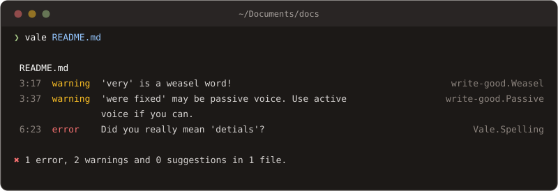

# CLI

Learn how the `vale` command reads its input, finds its configuration, and reports.

## [Input](cli.md#input)

`vale` takes files, directories, or nothing:

```sh
vale README.md docs/          # named files and directories, recursively
cat draft.md | vale --ext=.md # standard input
vale "Some text to check."    # a string that is not a path
```

A directory is walked for every file its configuration has a section for, narrowed by `--glob` when one is given; see [Globbing](../guides/globbing.md). Input on stdin is read as plain text unless `--ext` names a format, or `--path` names the file it came from, which also puts it under that path's configuration section. An argument that is neither a file nor a directory is linted as text, so a mistyped path that is nearly a command name is reported rather than checked.

With no input and nothing on stdin, `vale` prints a short introduction and an example configuration.

## [Configuration](cli.md#configuration)

A run needs a configuration file, found in this order:

1. The file named by `--config`.
2. The file named by `VALE_CONFIG_PATH`.
3. The first of `.vale.ini`, `_vale.ini`, `vale.ini`, `.vale`, or `_vale` found in the working directory or any directory above it, then in the home directory.

Whichever one is found, the user-level configuration in the operating system's config directory is read too, underneath it, so preferences that hold across projects live in one place and a project's own settings win. `vale ls-dirs` prints where that is, and `--no-global` leaves it out of a run.

The same two environment variables `ls-vars` reports are all Vale reads:

| Variable           | Description                                                                                  |
| ------------------ | -------------------------------------------------------------------------------------------- |
| `VALE_CONFIG_PATH` | A configuration file to use instead of searching for one.                                    |
| `VALE_STYLES_PATH` | The default [`StylesPath`](../keys/stylespath.md), used when no configuration file sets one. |

## [Commands](cli.md#commands)

| Name         | Description                                                                                                                                                                                                                          |
| ------------ | ------------------------------------------------------------------------------------------------------------------------------------------------------------------------------------------------------------------------------------ |
| `sync`       | <p>Install every entry in the configuration's <a href="../keys/packages.md"><code>Packages</code></a> key into the <code>StylesPath</code>. Run it after adding a package, and in CI before linting.<br><code>$ vale sync</code></p> |
| `ls-config`  | <p>Resolve the configuration the way a lint run would, every source in order, and print the result as JSON. The fastest way to see which styles and rules a directory has in scope.<br><code>$ vale ls-config</code></p>             |
| `ls-metrics` | <p>Print the counts Vale computed while reading a file, as JSON: words, sentences, paragraphs, and the elements of its markup. See <a href="../checks/metric.md">metric</a>.<br><code>$ vale ls-metrics README.md</code></p>         |
| `ls-dirs`    | <p>Print where Vale looks for the default <code>StylesPath</code>, the user-level configuration, and the native messaging host, and whether each is there.<br><code>$ vale ls-dirs</code></p>                                        |
| `ls-vars`    | <p>Print the environment variables Vale reads, what each does, and its current value.<br><code>$ vale ls-vars</code></p>                                                                                                             |
| `help`       | <p>Print the listing of options and commands, or one command's own help.<br><code>$ vale help sync</code></p>                                                                                                                        |

`ls-config`, `ls-dirs`, and `ls-vars` print JSON instead of a table under `--output=JSON`. The tables look like this on macOS:

```console
$ vale ls-dirs
Asset       | Default Location                                              | Found
StylesPath  | /Users/me/Library/Application Support/vale/styles             | ✓
.vale.ini   | /Users/me/Library/Application Support/vale/.vale.ini          | ✗
vale-native | /Users/me/Library/Application Support/vale/native/vale-native | ✗

$ vale ls-vars
Variable         | Description                                                         | Value
VALE_CONFIG_PATH | Override the default search process by specifying a .vale.ini file. | ✗
VALE_STYLES_PATH | Specify the location of the default StylesPath.                     | ✗
```

## [Options](cli.md#options)

| Name               | Description                                                                                                                                                                                                                                                      |
| ------------------ | ---------------------------------------------------------------------------------------------------------------------------------------------------------------------------------------------------------------------------------------------------------------- |
| `--config`         | <p>The configuration file to use, instead of searching for one.<br><code>$ vale --config='path/to/.vale.ini' README.md</code></p>                                                                                                                                |
| `--output`         | <p>The report format: <code>CLI</code>, <code>line</code>, <code>JSON</code>, or the path of a template. See <a href="cli.md#output">Output</a>.<br><code>$ vale --output=JSON README.md</code></p>                                                              |
| `--minAlertLevel`  | <p>The lowest level to report: <code>suggestion</code>, <code>warning</code>, or <code>error</code>. Overrides the configuration's <a href="../keys/minalertlevel.md"><code>MinAlertLevel</code></a>.<br><code>$ vale --minAlertLevel=error README.md</code></p> |
| `--glob`           | <p>A pattern the files under a directory must match. See <a href="../guides/globbing.md">Globbing</a>.<br><code>$ vale --glob='\*.md' docs/</code></p>                                                                                                           |
| `--filter`         | <p>An expression choosing which rules run. See <a href="filters.md">Filters</a>.<br><code>$ vale --filter='.Level == "error"' README.md</code></p>                                                                                                               |
| `--ext`            | <p>The format to read stdin as, by file extension.<br><code>$ echo "_This_ is Markdown" &#124; vale --ext=.md</code></p>                                                                                                                                         |
| `--path`           | <p>The file stdin stands for, so its configuration section and format apply and its path appears in the report.<br><code>$ cat draft.md &#124; vale --path=docs/draft.md</code></p>                                                                              |
| `--ignore-syntax`  | <p>Read every file as plain text, line by line, with no markup parsing.<br><code>$ vale --ignore-syntax README.md</code></p>                                                                                                                                     |
| `--no-exit`        | <p>Exit 0 even when errors were found.<br><code>$ vale --no-exit README.md</code></p>                                                                                                                                                                            |
| `--no-wrap`        | <p>Do not wrap long messages in the <code>CLI</code> format.<br><code>$ vale --no-wrap README.md</code></p>                                                                                                                                                      |
| `--no-color`       | <p>Do not color the <code>CLI</code> format.<br><code>$ vale --no-color README.md</code></p>                                                                                                                                                                     |
| `--no-global`      | <p>Do not read the user-level configuration.<br><code>$ vale --no-global README.md</code></p>                                                                                                                                                                    |
| `--plain-progress` | <p>Log each step of a long operation instead of redrawing a progress bar, for CI logs that keep every frame.<br><code>$ vale sync --plain-progress</code></p>                                                                                                    |
| `--version`, `-v`  | <p>Print the version.<br><code>$ vale --version</code></p>                                                                                                                                                                                                       |
| `--help`, `-h`     | <p>Print the listing of options and commands. After a command, that command's help.<br><code>$ vale sync --help</code></p>                                                                                                                                       |

## [Output](cli.md#output)

`--output` chooses how alerts are reported. The built-in formats sort them by line and column within each file.

**`CLI`**, the default, is a colored table per file with a summary line, wrapped to the terminal's width unless `--no-wrap` says otherwise:



Each row is the line and column, the level, the message, and the rule that fired. The summary counts every alert at or above `MinAlertLevel`, and the exit code follows the errors.

**`line`** is one alert per line, in the shape editors and scripts parse:

```console
$ vale --output=line README.md
README.md:3:17:write-good.Weasel:'very' is a weasel word!
README.md:3:37:write-good.Passive:'were fixed' may be passive voice. Use active voice if you can.
README.md:6:23:Vale.Spelling:Did you really mean 'detials'?
```

**`JSON`** is an object keyed by file path, each holding its alerts. An alert carries the rule, the level, the matched text, its line and span, the message, and any [action](actions.md) with what it resolves to:

```json
{
	"README.md": [
		{
			"Action": { "Name": "replace", "Params": ["use"] },
			"Suggestions": ["use"],
			"Span": [9, 15],
			"Check": "House.Terms",
			"Description": "",
			"Link": "",
			"Message": "Use 'use' instead of 'utilize'.",
			"Severity": "error",
			"Match": "utilize",
			"Line": 1
		}
	]
}
```

**A template** is anything else: the path of a Go template, or the name of one in the `StylesPath`'s `config/templates` directory, rendered with the same data. See [Templates](templates.md).

Errors in Vale's own configuration are printed to standard error, and follow `--output` where the format has a place for them: a rule that fails to load reports its file and line.


## [Exit codes](cli.md#exit-codes)

| Code | Meaning                                                                                                            |
| ---- | ------------------------------------------------------------------------------------------------------------------ |
| `0`  | The run completed and found no alert at the `error` level. Warnings and suggestions do not change the code.        |
| `1`  | The run completed and found at least one `error`. `--no-exit` turns this into `0`, for a CI job that reports only. |
| `2`  | Vale itself could not run: a missing configuration, a rule that failed to load, an argument that is not a path.    |
