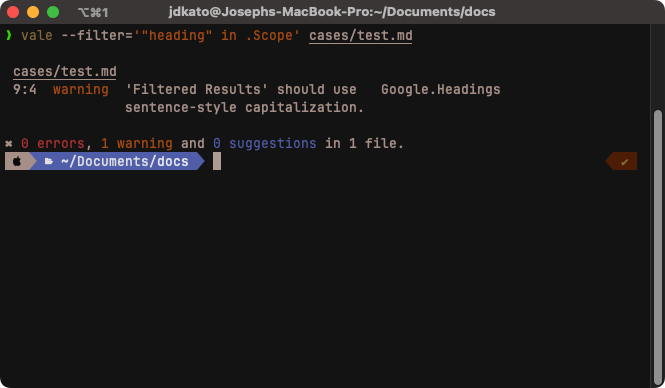

# Filters

Learn about Vale's rule filtering system.

The `--filter` CLI option allows you to report an arbitrary subset of your `.vale.ini` configuration.



A filter is an [expression](https://expr-lang.org/docs/language-definition) targeting one of the following keys defined in the rule definition: `.Name`, `.Level`, `.Scope`, `.Message`, `.Description`, `.Extends`, or `.Link`.

## Saving filters

You can save a filter for reuse by storing it in `<StylesPath>/config/filters`. Then, you can reference it by name when using the `--filter` option:

```bash
$ vale --filter=headings.expr docs/
```

Where `headings.expr` is a file containing the filter expression, such as:

```tengo
"heading" in .Scope
```

## Examples

* Filter by `.Level` and `.Name`:

```tengo
.Level in ["error", "suggestion"] and .Name != "demo.Cap"
```

* Filter by `.Extends`:

```tengo
.Extends=="existence"
```

* Only run a specific rule:

```tengo
.Name=="demo.Cap"
```

See the [documentation](https://expr-lang.org/docs/language-definition#operators) for a list of all supported operators.
