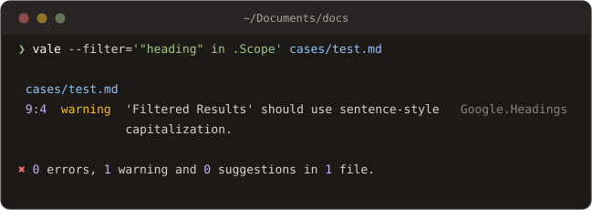

# Filters

Learn how to run a subset of the rules a configuration enables.

`--filter` takes an expression over the rules the configuration loaded, and runs only the ones it selects:

```sh
vale --filter='.Level == "error"' docs/
```

A filter narrows a run and never widens it: a rule the configuration did not enable is not there to select. Everything else about the run stays as configured, with one exception. When the expression mentions `.Level`, the minimum alert level drops to include what it selected, so `--filter='.Level == "suggestion"'` shows suggestions even under `MinAlertLevel = warning`.



## [The expression](filters.md#the-expression)

A filter is an [expression](https://expr-lang.org/docs/language-definition), evaluated once per rule against the rule's header. The fields are the ones every rule opens with, capitalized:

| Field          | Type       | Example                                    |
| -------------- | ---------- | ------------------------------------------ |
| `.Name`        | `string`   | `.Name == "Microsoft.Contractions"`        |
| `.Level`       | `string`   | `.Level in ["error", "warning"]`           |
| `.Scope`       | `string[]` | `"heading" in .Scope`                      |
| `.Extends`     | `string`   | `.Extends == "spelling"`                   |
| `.Message`     | `string`   | `.Message contains "instead"`              |
| `.Description` | `string`   | `.Description != ""`                       |
| `.Link`        | `string`   | `.Link startsWith "https://developers."`   |

`.Scope` is a list because a rule may name several, so membership is the test. Expressions combine with `and`, `or`, and `not`, and the [operators](https://expr-lang.org/docs/language-definition#operators) include `matches` for a regular expression:

```sh
# Every rule from one style, at any level.
vale --filter='.Name startsWith "Google."' docs/

# Only spelling, and only in headings.
vale --filter='.Extends == "spelling" and "heading" in .Scope' docs/

# Everything except one rule.
vale --filter='.Name != "Vale.Spelling"' docs/
```

## [Saving a filter](filters.md#saving-a-filter)

A filter that is typed twice belongs in a file. `--filter` accepts a path, or the name of a file in the `StylesPath`'s `config/filters` directory:

```sh
vale --filter=headings.expr docs/
```

```
# config/filters/headings.expr
"heading" in .Scope
```

The value is tried as a path first, then as a name on the `StylesPath`, and read as an expression only when it is neither, so a file that is not where it was expected is reported as a bad expression rather than silently run as one.
